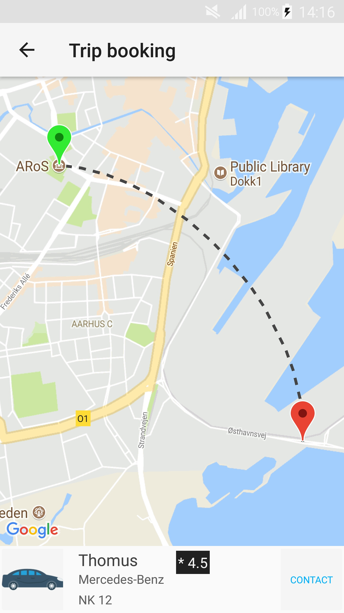
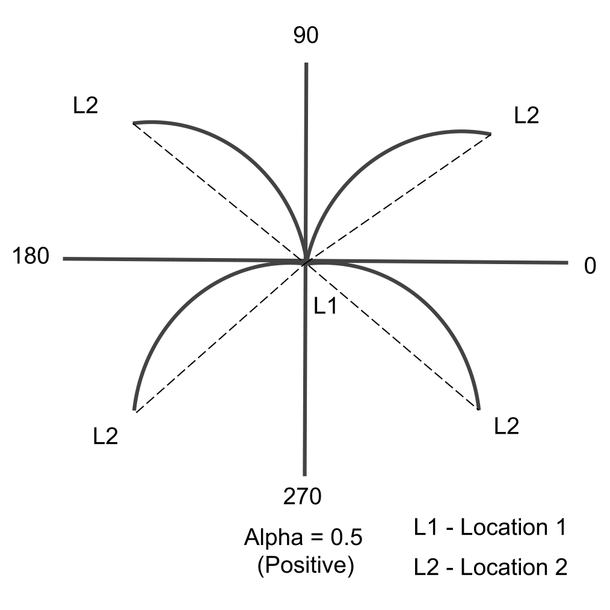
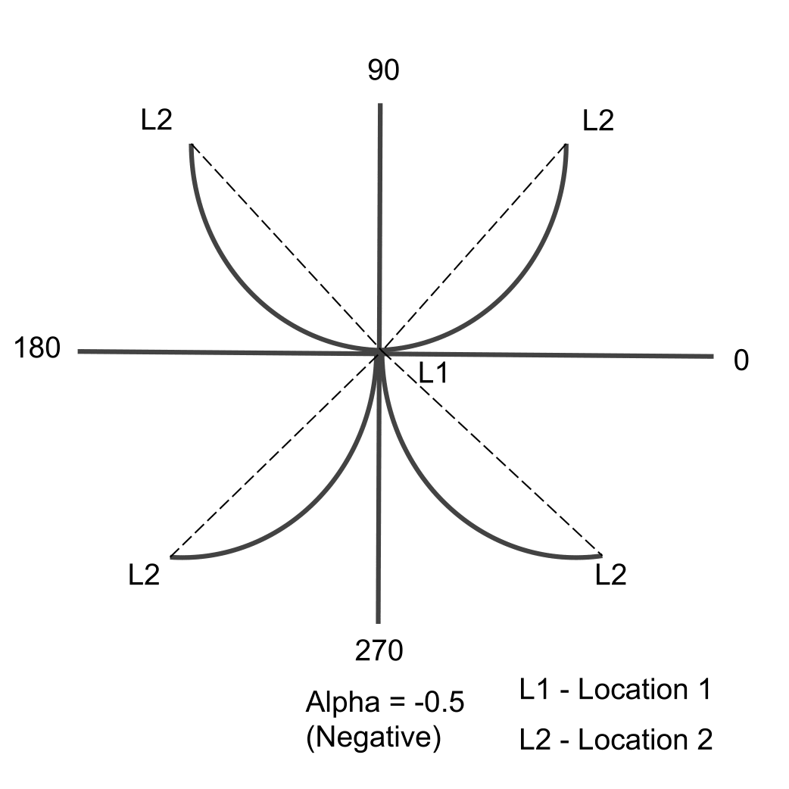
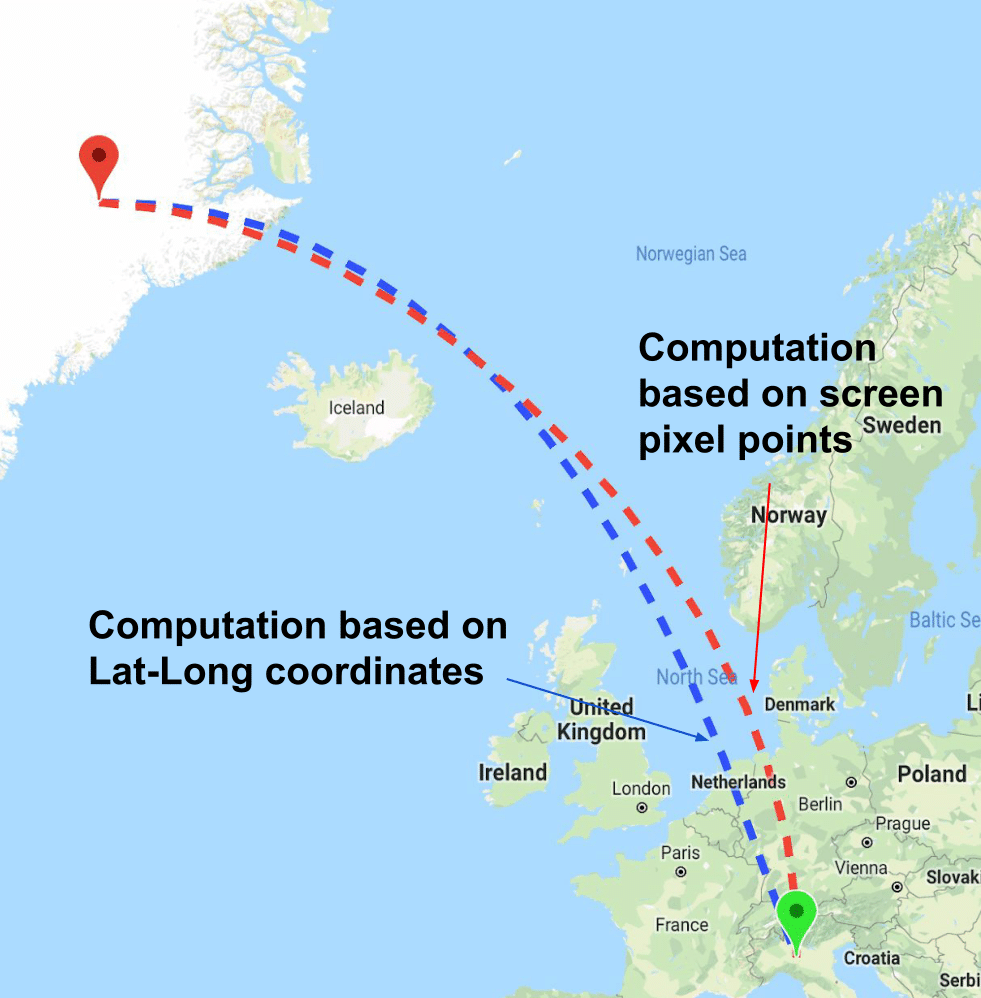

# Curve-Fit
[](https://android-arsenal.com/details/1/7152)
[](https://github.com/sarweshkumar47/Curve-Fit/releases/tag/version_1_1_1)
[](https://github.com/sarweshkumar47/Curve-Fit#license)

Android library for drawing curves on Google Maps. This library uses Bezier cubic equation in order to compute all
intermediate points of a curve.

# Changes
* Please note that this release only works with Google Maps Android SDK v2. If you are experimenting with
  Google Maps Android SDK 3.0.0 BETA, try using [CurveFit-2.0.0-beta](https://github.com/sarweshkumar47/Curve-Fit/releases/tag/version_2_0_0_beta)
* [bug] Fixed ([#4][i4]) ([#6][i6])

[i4]: https://github.com/sarweshkumar47/Curve-Fit/issues/4
[i6]: https://github.com/sarweshkumar47/Curve-Fit/issues/6

# Demo
[](https://play.google.com/store/apps/details?id=com.makesense.labs.curvefitexample)

<p align="center" >


 </p>

# Setup
### Gradle
```
dependencies {
    implementation 'com.github.sarweshkumar47:curve-fit:1.1.1'
}
```
  
### Maven
```
<dependency>
 <groupId>com.github.sarweshkumar47</groupId>
 <artifactId>curve-fit</artifactId>
 <version>1.1.1</version>
 <type>pom</type>
</dependency>
```

# Usage

In your activity's onCreate() method, use ```getMapAsync()``` to register for the map callback. 
Implement ```OnMapReadyCallback```, ```OnCurveDrawnCallback```,
        ```OnCurveClickListener``` interfaces and override the ```onMapReady()``` method

```java
@Override
public void onMapReady(GoogleMap googleMap) {

    // Create a CurveManager object and pass googleMaps reference to it
    curveManager = new CurveManager(googleMap);

    // Register a callback to be invoked after curve is drawn on map
    curveManager.setOnCurveDrawnCallback(this);
    
    // Set a listener for curve click events.
    curveManager.setOnCurveClickListener(this);
        
    // Create a CurveOptions object and add atleast two latlong points to it
    // You can set different options in CurveOptions object similar to PolyLineOptions
    CurveOptions curveOptions = new CurveOptions();
    curveOptions.add(new LatLng(12.9715987, 77.5945627));
    curveOptions.add(new LatLng(12.2958104, 76.6393805));
    curveOptions.color(Color.DKGRAY);
    curveOptions.setAlpha(0.5f);
    curveOptions.width(12);
    List<PatternItem> pattern = Arrays.asList(new Dash(30), new Gap(30));
    curveOptions.pattern(pattern);
    curveOptions.geodesic(false);

    map.addMarker(new MarkerOptions().position(sourceLatLng).anchor(0.5f, 1f));
    map.addMarker(new MarkerOptions().position(destinationLatLng).icon(BitmapDescriptorFactory
            .defaultMarker(BitmapDescriptorFactory.HUE_GREEN)).anchor(0.5f, 1f));

    map.moveCamera(CameraUpdateFactory.newLatLngZoom(new LatLng(12.64779202, 77.16562563), 14));
    
    // Draws curve asynchronously
    curveManager.drawCurveAsync(curveOptions);
}
```

Remove listeners in order to prevent memory leaks.
``` java
@Override
protected void onDestroy() {
    if (curveManager != null) {
        curveManager.unregister();
        curveManager = null;
    }
    if (map != null) {
        map.stopAnimation();
        map.clear();
        map = null;
    }
    if (mapFragment != null) {
        mapFragment.getMapAsync(null);
        mapFragment = null;
    }
    super.onDestroy();
}

```
Check example projects for more info.

# Advanced usage

### CurveOptions

* __Alpha__
```java 
CurveOptions setAlpha(float alpha)
```

Defines shape and deviation of a curve. Alpha can vary from -1 to 1. The below images demonstrate how alpha value is used to define the shape and deviation of a curve in the algorithm (default value is 0.5).


<p align="center" >

 </p>


_Note:_ This behaviour may vary when a curve passes through 180 degree meridian. Sometimes, you may not get a perfect curve. In that case, use ```setComputePointsBasedOnScreenPixels(true)``` method to get the desired curve.


* __ComputePointsBasedOnScreenPixels__
```java 
CurveOptions setComputePointsBasedOnScreenPixels(boolean computePointsBasedOnPixels)
```

If set to ```true```, geographic location points will be converted to screen pixel points and algorithm uses screen pixel points to compute all intermediate curve points. Refer the below image to understand the variations.

<p align="center" >

</p>


_Note:_ Method ```setComputePointsBasedOnScreenPixels(true)``` gives a perfect curve regardless of the geographical locations. But it has certain limitations. This method requires more computation time. Sometimes, you may a get a strangely shaped curve when the two lat-long points are off the screen (outside the visible region) or when two points are too close at lower zoom levels. Workaround to this problem is to compute the lat-long bounds and zoom the map camera towards the center of the bounds.


# Contributions
Contributions are welcome and much appreciated.

# Credit
### Icons and images
* <div>Icons made by <a href="https://www.freepik.com/" title="Freepik">Freepik</a> from <a href="https://www.flaticon.com/" title="Flaticon">www.flaticon.com</a> is licensed by <a href="http://creativecommons.org/licenses/by/3.0/" title="Creative Commons BY 3.0" target="_blank">CC 3.0 BY</a></div>

* <div>Icons made by <a href="https://www.flaticon.com/authors/dinosoftlabs" title="DinosoftLabs">DinosoftLabs</a> from <a href="https://www.flaticon.com/" title="Flaticon">www.flaticon.com</a> is licensed by <a href="http://creativecommons.org/licenses/by/3.0/" title="Creative Commons BY 3.0" target="_blank">CC 3.0 BY</a></div>

* https://upload.wikimedia.org/wikipedia/commons/d/d5/India_gate.jpg


# License
    Copyright 2018 Sarweshkumar C R

    Licensed under the Apache License, Version 2.0 (the "License");
    you may not use this file except in compliance with the License.
    You may obtain a copy of the License at

       http://www.apache.org/licenses/LICENSE-2.0

    Unless required by applicable law or agreed to in writing, software
    distributed under the License is distributed on an "AS IS" BASIS,
    WITHOUT WARRANTIES OR CONDITIONS OF ANY KIND, either express or implied.
    See the License for the specific language governing permissions and
    limitations under the License.
